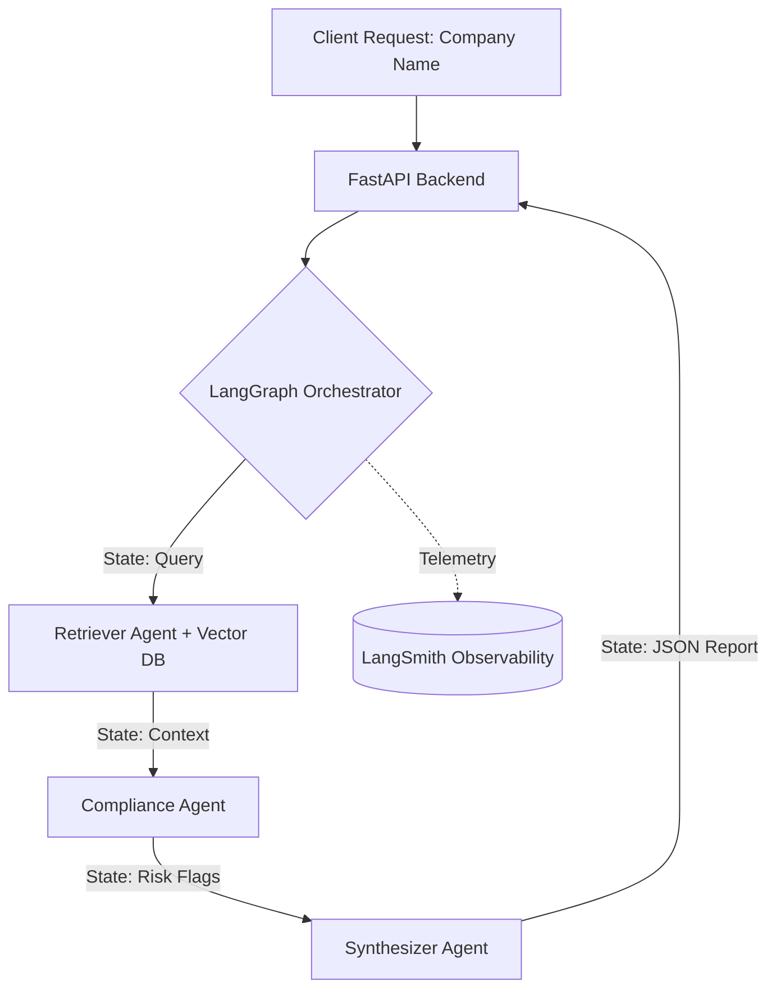

```markdown
# CorpRisk-AI: Multi-Agent Corporate Due Diligence System 🏦🤖


## 📌 Project Overview
**CorpRisk-AI** is a cloud-native, multi-agent AI system designed to automate corporate banking due diligence and risk assessment. Built using **LangGraph** and **LangChain**, the system orchestrates multiple AI agents to retrieve company financial records, analyze compliance against Anti-Money Laundering (AML) policies, and synthesize structured risk reports.

This project was developed to demonstrate enterprise-grade AI engineering, specifically focusing on **agentic workflows**, **RAG (Retrieval-Augmented Generation) architectures**, and **LLM observability** for financial services.

## 🏗️ Architecture & Agentic Workflow

The application uses a stateful graph architecture (`LangGraph`) containing three distinct reasoning agents:

1. **Document Retriever Agent (RAG):** Connects to a Vector Database (ChromaDB/FAISS) to fetch semantically relevant financial documents, unstructured data, and mock AML policy PDFs based on the target company.
2. **Compliance & Risk Agent:** Evaluates the retrieved context against established banking guardrails. Identifies high-risk indicators, compliance breaches, or missing financial data.
3. **Report Synthesizer Agent:** Aggregates findings from the previous agents into a structured JSON payload, providing a final decision (e.g., `APPROVED`, `MANUAL_REVIEW`, `REJECTED`).


*(Note: GitHub natively renders Mermaid diagrams. The above will display as a beautiful flowchart in your repo!)*

## 🚀 Key Features
* **Multi-Agent Orchestration:** Utilizes LangGraph for stateful, cyclic, and conditional agent execution.
* **Enterprise RAG Pipeline:** Employs optimized document chunking and vector embeddings for precise context retrieval.
* **LLM Observability & Evaluation:** Integrated deeply with **LangSmith** to monitor token usage, track execution latency, and evaluate prompt performance and AI safety guardrails.
* **Cloud-Native & Scalable:** Wrapped in a **FastAPI** application and containerized via **Docker**, making it ready for deployment on Azure Kubernetes Service (AKS) or Azure Container Apps.
* **Azure Ecosystem Ready:** Designed to seamlessly swap standard OpenAI endpoints with secure **Azure OpenAI** enterprise endpoints.

## 🛠️ Tech Stack
* **Core AI:** Python, LangChain, LangGraph, OpenAI / Azure OpenAI
* **Data & RAG:** ChromaDB / FAISS (Vector Store), PyPDFLoader
* **Backend:** FastAPI, Uvicorn, Pydantic
* **DevOps & Observability:** Docker, LangSmith
* **Domain:** FinTech, Banking Compliance, Risk Analysis

## ⚙️ Local Installation & Setup

### Prerequisites
* Python 3.10+
* Docker (Optional, for containerized run)
* OpenAI API Key (or Azure OpenAI credentials)
* LangSmith API Key (for observability)

### 1. Clone the repository
```bash
git clone https://github.com/NeelM47/CorpRisk-AI.git
cd CorpRisk-AI
```

### 2. Environment Variables
Create a `.env` file in the root directory:
```env
OPENAI_API_KEY=your_openai_key
LANGCHAIN_TRACING_V2=true
LANGCHAIN_ENDPOINT="https://api.smith.langchain.com"
LANGCHAIN_API_KEY=your_langsmith_key
LANGCHAIN_PROJECT="CorpRisk-DueDiligence"
```

### 3. Setup Virtual Environment & Install Dependencies
```bash
python -m venv venv
source venv/bin/activate  # On Windows: venv\Scripts\activate
pip install -r requirements.txt
```

### 4. Ingest Mock Data (RAG Setup)
Run the ingestion script to populate the Vector DB with mock corporate financial reports and AML policies.
```bash
python src/ingest_data.py
```

### 5. Run the Application
**Via Python:**
```bash
uvicorn src.main:app --reload --host 0.0.0.0 --port 8000
```

**Via Docker:**
```bash
docker build -t corprisk-ai .
docker run -p 8000:8000 --env-file .env corprisk-ai
```

## 📡 API Usage
Once the server is running, access the automatic Swagger documentation at `http://localhost:8000/docs`.

**Endpoint:** `POST /api/v1/assess-company`

**Request Payload:**
```json
{
  "company_name": "TechCorp Innovations Ltd",
  "assessment_type": "standard_due_diligence"
}
```

**Response Payload:**
```json
{
  "company_name": "TechCorp Innovations Ltd",
  "status": "MANUAL_REVIEW",
  "retrieved_documents": 4,
  "risk_flags":[
    "Incomplete UBO (Ultimate Beneficial Owner) documentation for Q3.",
    "Unusual cross-border transaction volume detected in mock financial summary."
  ],
  "summary": "TechCorp Innovations Ltd shows healthy revenue streams, but flagged transactions require secondary compliance review according to AML Policy section 3.2."
}
```

## 📊 LLM Observability & Evaluation
To ensure AI safety and reliable performance, this system relies on **LangSmith**. Every API call generates a trace that tracks:
1. **Agent Trajectories:** Step-by-step reasoning logs of the Compliance Agent.
2. **Retrieval Effectiveness:** What exact chunks were pulled from the Vector DB.
3. **Cost & Latency:** Token usage metrics for cost optimization.

*(Feel free to check the `assets/` folder for screenshots of the LangSmith dashboard tracking this application).*

## 🤝 Next Steps & Future Work
- [ ] Migrate Vector Store from local ChromaDB to Azure AI Search.
- [ ] Implement robust CI/CD pipelines via Azure DevOps.
- [ ] Add Human-in-the-Loop (HITL) approval nodes in the LangGraph workflow.

---
*Designed and developed by [Neel More](https://www.linkedin.com/in/neel-more-ai/) as a demonstration of scalable AI engineering in the financial sector.*
```kjkjkjkjk
